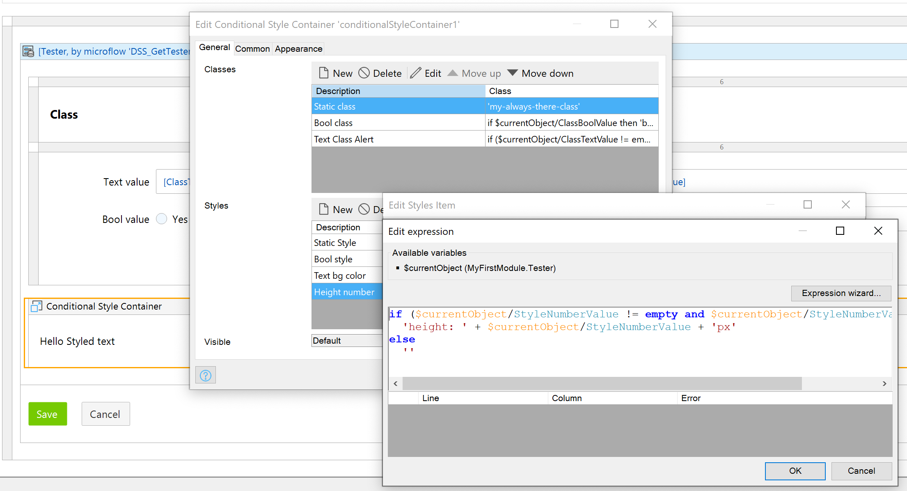

## Conditional Style Container

**Warning: This prototype is for demonstration purposes only. And is not an official Mendix product with support.**

Set styling and class to a container based on expressions.

### Usage
 - Place the widget on a page
 - Add your content inside the widget
 - Add `Classes`
    - Use an expression that returns a one or more class names, class names should be separated by a space
        ``` delphi
        if $currentObject/ClassBoolValue then 
            'bool-class'
        else
            ''
        ```
 - Add `Styles`
    - Us an expression return one or style properties, style properties should separated by semi columns.
        ``` delphi
        if ($currentObject/StyleTextValue != empty and trim($currentObject/StyleTextValue) != '' ) then 
            'background-color:' + $currentObject/StyleTextValue + ';'
        else 
            ''
        ```


